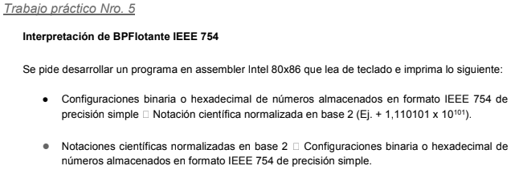

# ASM-x86-IEEE754
Intel 80x86 assembly program that reads binary or hexadecimal configurations of numbers in simple precision IEEE754 format from the keyboard and converts them to standard scientific notation in base 2, and vice versa.

  
